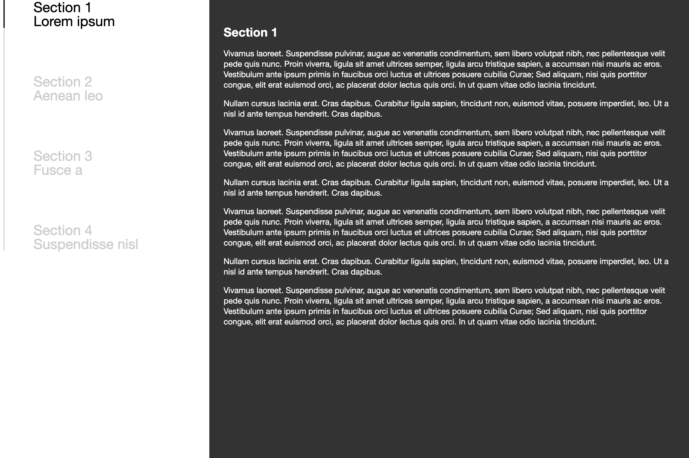

# Vertical magic line navigation
Sticky navigation with magic line at left and content on right side.

Nagivation:
- For navigation <b>nav</b> tag is used and inside nav tag unorder list(ul li) is used.
- Inside ul li, anchor tag is used with reference of internal link in href.

Content:
- For content inside one wrapper div <b>section</b> tag is used with id and class.
- ID is used for internal reference from navigation anchor.

CSS:
- <b>style.css</b> file used for css.

JS:
- <b>script.js</b> file used for jquery.

Screenshot:
- 